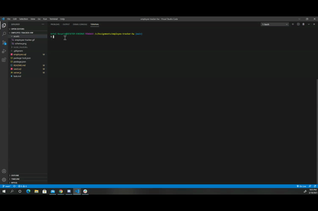

# Employee Tracker

- Build a team profile database based on a few inputs through command line.

## Table of contentens

- [Description](#Description)
- [Links](#Links)
- [Resources](#Resources)
- [Screenshot](#Screenshot)

## Description

- command line prompt, you can create a database of employees including name, roles, department, salary, and manager. Add new employees, roles, or departments. Even, view your database in a table form in the terminal.

## Links

- Link to Github Repository: https://github.com/urielrosario/employee-tracker-hw.git

## Resources

- https://www.npmjs.com/package/inquirer
- https://www.npmjs.com/package/mysql
- https://www.npmjs.com/package/console.table
- Bootcamp assignments

## WalkThrough

